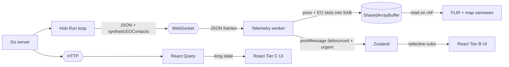
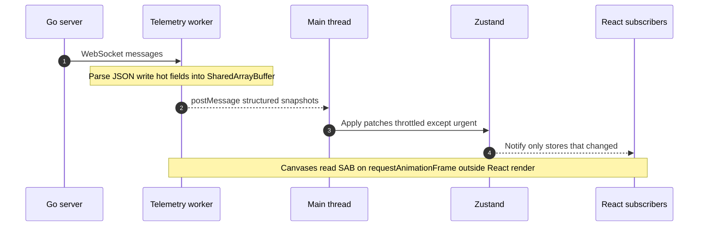
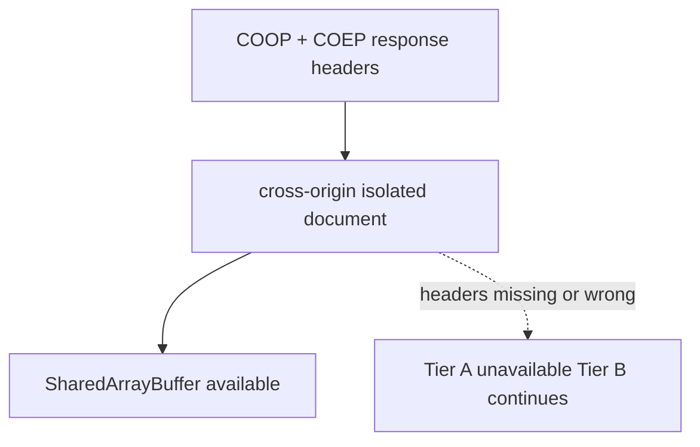
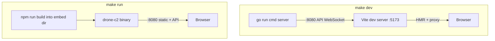

# Architecture (concise)

## Problem

Browser UIs that show live tracks and sensor views need **high frequency presentation** (smooth drawing) without **React re-rendering on every telemetry message**. This demo keeps a clear split: **imperative canvases** for the hot path, **Zustand** for operator chrome at a lower cadence.

### Data path at a glance

The **hub** attaches **`syntheticEOContacts`** to each drone’s JSON message: normalized FLIR positions, visibility, **ΔMSL** (target − own), and **slant range**, from a snapshot of latest positions—so **EO geometry stays in the synthetic path**, not in React. The worker copies core pose plus fixed **EO slots** into the SAB (per-drone stride includes that block); the FLIR canvas **only** formats and draws (plus presentation smoothing and **paint order by slant range**).

### Main thread vs worker (telemetry)

## Hot path (Tier A)

1. **WebSocket** receives JSON telemetry in a **dedicated worker** so the main thread does not parse or dispatch at wire rate.
2. The worker writes **numeric fields** into a **SharedArrayBuffer** (SAB): core pose per drone plus **synthetic EO contact slots** (norm position, ΔMSL, slant range) copied from the message—no trigonometry in the worker.
3. **FLIR** and **map track heads** read the SAB inside **`requestAnimationFrame`**, so draw cadence follows the display, not React.

## Slower UI (Tier B)

Strings, modes, alerts, trails, and bounding boxes need structured objects. The worker **postMessage**s full messages on a **~500 ms** debounce plus **urgent** exceptions (mode change, armed, low link/battery). **Zustand** updates only subscribers that care about that slice.

## Reference data (Tier C)

Topology and drone registry use **HTTP** and **React Query** with long stale times so config fetches do not compete with the live socket.

## COOP / COEP and SAB

**SharedArrayBuffer** in the renderer needs a **cross-origin isolated** context. **Vite dev** sets **COOP** / **COEP** in `web/vite.config.ts`. The **Go** server applies the same headers on HTTP responses via `addSecurityHeaders` in `cmd/server/main.go`. Any other static host must do the equivalent; without isolation, `SharedArrayBuffer` is missing and **Tier A** stops (the app still runs on **Tier B**).

### Dev vs production UI delivery

## Production shaped follow ups (not implemented here)

- **Telemetry**: binary protocol (Protobuf / MessagePack) instead of JSON at scale.
- **Video**: real EO/IR via **WebRTC** or **MSE**, not only synthetic canvas; **gazebo-bridge** style RTSP is one ingest option before browser decode.
- **Back end**: connect to **[dronekit-runtime](https://github.com/AvantOpsIO/dronekit-runtime)** style services instead of the in process simulator.

## DATA LAYERS overlay

The yellow debug panel exists to **teach the tier map** in demos: what updates at wire rate, what is throttled, and where HTTP fits.

## Theme tokens

All colors live in `web/src/constants/tactical.ts` as `COLORS`. On startup, `applyC2CssVariables()` copies them to CSS custom properties `--c2-*` on the document element. Global CSS (`index.css`) and DOM components use `var(--c2-…)` via the `c2()` helper; **canvas** code keeps using the `COLORS` object because the canvas 2D API does not consume CSS variables.
