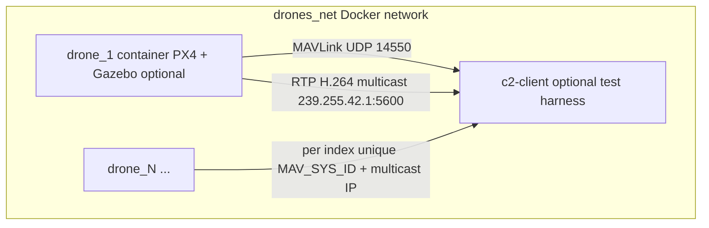

# PX4 SITL + Gazebo Classic (Docker)

Headless **Gazebo Classic 11** + **PX4 v1.14.3** SITL in one container per drone. MAVLink GCS UDP listens on **14550** inside the container (ROMFS overlay). A synthetic **H.264 RTP** stream is published to **multicast** `239.255.42.<DRONE_INDEX>:5600` so multiple drones do not collide on one collector IP.

### Topology (Docker)



## Requirements

- Linux host (x86_64) with Docker and Docker Compose v2.
- First **image build** typically **30–90+ minutes** and several **GB** of disk; PX4 + Gazebo Classic compile from source.

## Build

From the **repository root**:

```bash
docker compose build drone
```

### Apple Silicon / ARM64

OSRF **Gazebo Classic 11** packages are not published for **arm64**; `docker compose build drone` fails there. Use either:

- **`USE_MOCK=1 ./scripts/test-sitl-drone.sh`** (default) — MAVLink + RTP harness without PX4, or  
- **amd64 build**: `docker compose build --platform linux/amd64 drone` (slow under emulation).

## Automated test (MAVLink + “camera” RTP)

```bash
./scripts/test-sitl-drone.sh          # mock drone (works on ARM64)
USE_MOCK=0 ./scripts/test-sitl-drone.sh   # real PX4 image (needs successful `drone` build, usually amd64)
```

The integration container runs [test_mavlink_video.py](integration-test/test_mavlink_video.py): HEARTBEAT, `PARAM_REQUEST_READ` / `MAV_SYS_ID`, `COMMAND_LONG` (request message + arm), optional `GLOBAL_POSITION_INT`, and **multicast RTP** on `239.255.42.<DRONE_INDEX>:5600`.

## Single container (quick test)

```bash
docker compose run --rm -e DRONE_INDEX=1 --name drone_1 drone
```

Connect from another container on `drones_net`:

```bash
docker compose run --rm -e DRONE_HOSTS=drone_1 c2-client
```

## Fleet (recommended): unique `MAV_SYS_ID` + stable names

Plain `docker compose up --scale drone=N` does **not** assign different `DRONE_INDEX` values; every replica would share the same `MAV_SYS_ID` unless you add another mechanism (Swarm task slots, docker-socket label reads, etc.).

Use the helper script:

```bash
chmod +x scripts/up-fleet.sh scripts/down-fleet.sh
./scripts/up-fleet.sh 3
```

This starts `drone_1` … `drone_N` with `DRONE_INDEX` matching the suffix.

Tear down:

```bash
./scripts/down-fleet.sh
```

## Endpoints (Docker DNS)

| Path | Description |
|------|-------------|
| `udp://drone_i:14550` | MAVLink (GCS-style link; pymavlink / QGC / MAVSDK) |
| `udp://239.255.42.i:5600` | RTP H.264 test pattern (multicast; `DRONE_INDEX=i`) |

`c2-client` defaults to `DRONE_HOSTS=drone_1,drone_2,drone_3`. Override when your fleet size or names differ.

## Environment variables

| Variable | Default | Meaning |
|----------|---------|---------|
| `DRONE_INDEX` | unset | If set, `px4-rc.params` sets `MAV_SYS_ID` to this value |
| `ENABLE_VIDEO` | `1` | `0` disables the GStreamer pipeline |
| `GAZEBO_MODEL` | `iris` | Passed to `sitl_run.sh` |
| `GAZEBO_WORLD` | `empty` | World name under PX4’s Classic worlds dir |
| `VIDEO_UDP_PORT` | `5600` | Multicast UDP port |
| `VIDEO_UDP_TTL` | `1` | Multicast TTL |

`c2-client` also supports **`C2_EXIT_AFTER_CHECK=1`** to exit after MAVLink (and optional video) instead of sleeping forever.

## `docker compose up --scale drone=N` caveat

The service name `drone` resolves to **multiple container IPs**. UDP clients that resolve `drone` once may stick to a single replica. Prefer **per-container names** (`drone_1`, …) from `up-fleet.sh`, or DNS to `${COMPOSE_PROJECT_NAME}_drone_<n>` for scaled services.

## Troubleshooting

- **Healthcheck slow / failing**: SITL + Gazebo can take **minutes** on first boot; `start-period` is 300s. Check logs: `docker logs drone_1`.
- **No MAVLink from host**: By design there are **no published host ports**; run your C2 stack **on `drones_net`** (as `c2-client` does).
- **Gazebo / GPU**: Image uses **Xvfb** + Mesa software GL; performance is for CI/integration, not real-time FPS.
- **Real camera video**: Current pipeline is `videotestsrc`. Bridging a Gazebo Classic camera topic without ROS is a follow-up (GStreamer `appsrc` + small Gazebo transport subscriber).

## Files

- `sitl/Dockerfile` — Ubuntu 22.04, Gazebo 11, PX4 build, health check.
- `sitl/entrypoint.sh` — Xvfb, optional video, `sitl_run.sh`.
- `sitl/overlay/ROMFS/...` — `px4-rc.mavlink` (UDP **14550**), `px4-rc.params` (`MAV_SYS_ID`).
- `sitl/gstreamer/rtp-udp-5600.sh` — RTP/H.264 multicast sender.
- `docker-compose.yml` — `drones_net`, `drone`, `c2-client`.
- `scripts/up-fleet.sh` / `down-fleet.sh` — named fleet lifecycle.
